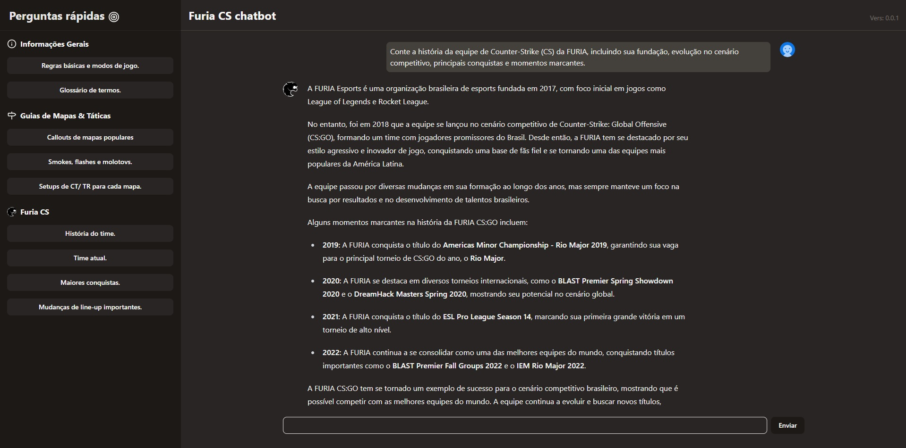

# FURIA CS Chatbot

Um chatbot interativo com foco total no universo de **Counter-Strike** e, principalmente, na equipe brasileira **FURIA**.  
Criado como projeto web com interface moderna, ele responde a perguntas sobre estratégias, mapas, táticas, lineups, modos de jogo e tudo que envolve o cenário competitivo de CS — com destaque para o time da FURIA.



---

## 🚀 Funcionalidades

- 💬 Chat com IA que responde sobre Counter-Strike e a equipe FURIA.
- ⚡ Perguntas rápidas com sugestões clicáveis.
- 🧠 Conectado a um modelo local via **Ollama** usando **Gemma 2**.
- 🎯 Restrições inteligentes: o bot responde **somente sobre CS e FURIA**.
- 📚 Prompts otimizados para glossário, mapas, utilitários, história do time e muito mais.
- 💡 Interface rápida e responsiva com feedback em tempo real.

---

## 🛠️ Tecnologias Utilizadas

- **React + Next.js** – Framework para criação da interface e rotas.
- **TypeScript** – Tipagem estática para maior segurança no desenvolvimento.
- **Tailwind CSS** – Estilização moderna e responsiva.
- **shadcn/ui** – Componentes acessíveis e prontos para uso.
- **Ollama com Gemma 2** – Para rodar o modelo de linguagem localmente.
- **AI SDK da Vercel** – Para facilitar a integração com IA e streaming de resposta.

---

## 🧠 Conexão com IA

Exemplo de código da integração com o modelo de IA via `Ollama`:

```ts
import { createOllama } from 'ollama-ai-provider';
import { streamText } from 'ai';

const ollama = createOllama();

const prompt = "" // Prompt responsável por restringir o modelo a responder apenas sobre CS e FURIA 

export async function POST(request: Request) {
  const { messages } = await request.json();

  const result = await streamText({
    model: ollama('gemma2'),
    system: prompt,
    messages
  });
  return result.toDataStreamResponse();
}
```

---

## 📣 Aviso Importante sobre o Modelo de IA

**Atenção:** O modelo de IA utilizado neste projeto atualmente é o **Gemma2**, através do **Ollama**. No entanto, como o modelo pode estar desatualizado, há a possibilidade de ele não fornecer respostas precisas ou completamente atualizadas, especialmente sobre tópicos recentes.

Para obter resultados mais precisos e atualizados, recomenda-se substituir o uso do **Ollama** por **OpenAI** (como o modelo GPT-4 ou GPT-3.5), que são mais avançados e frequentemente atualizados.

Para realizar essa mudança, basta ajustar a integração com o modelo na configuração do projeto para usar a API da OpenAI.

#### Exemplo de código da integração com o modelo de IA com `OpenAI`:

```ts
import { Configuration, OpenAIApi } from 'openai-edge';
import { OpenAIStream, StreamingTextResponse } from 'ai';

const config = new Configuration({
  apiKey: process.env.OPENAI_API_KEY // Chave da OpenAI
})
const openai = new OpenAIApi(config);
export const runtime = 'edge';

export async function POST(request: Request) {
  const { message } = request.json();

  const response = await openai.createChatCompletion({
    model: 'gpt-3.5-turbo', // versão do modelo
    stream: true;
    message
  })
  const stream = OpenAIStream(response);

  return new StreamingTextResponse(stream);
}
```
#### ⚠️ lembrete
 - Ao utilizar a OpenAI a dependência necessária sera `openai-edge` ao invés de `ollama-ai-provider`

 - OpenAI não é gratuita. 

---

## 🧪 Como rodar o projeto localmente

Siga os passos abaixo para rodar o projeto em ambiente local:

1. **Clone o repositório:**
```bash
   git clone https://github.com/seu-usuario/furia-cs-chatbot.git
   cd furia-cs-chatbot
```
2. **Instale as dependências:**
```bash
   npm install
```
3. **Execute o projeto em modo desenvolvimento:**
```bash
   npm run dev
```
4. **InsCertifique-se de que o Ollama está rodando com o modelo gemma2:**
```bash
   ollama run gemma2
```

## 🧑‍💻 Autor

Este projeto foi desenvolvido por **GabrielMartinsss** como um experimento educacional e pessoal com foco em IA, NLP e aplicações no universo de e-sports.  
Sinta-se à vontade para explorar, aprender e adaptar.

## 📄 Licença

Distribuído sob a licença MIT.  
Veja o arquivo [`LICENSE`](./LICENSE) para mais detalhes.
